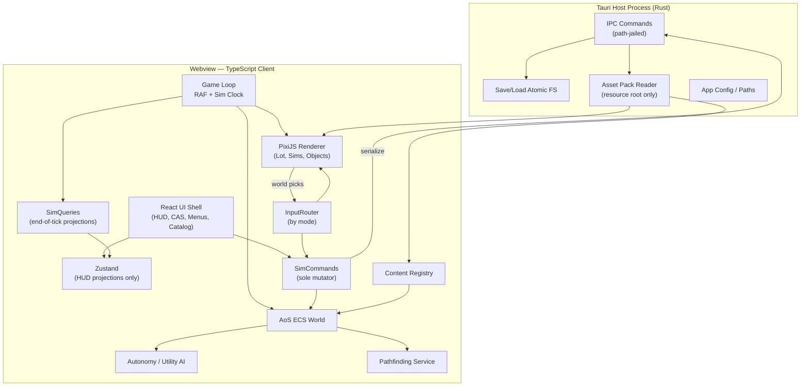
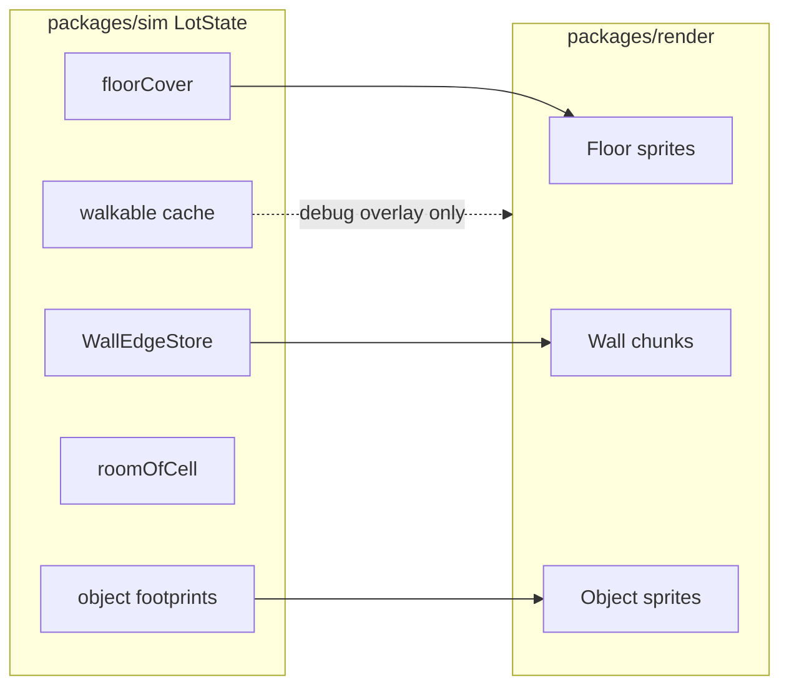
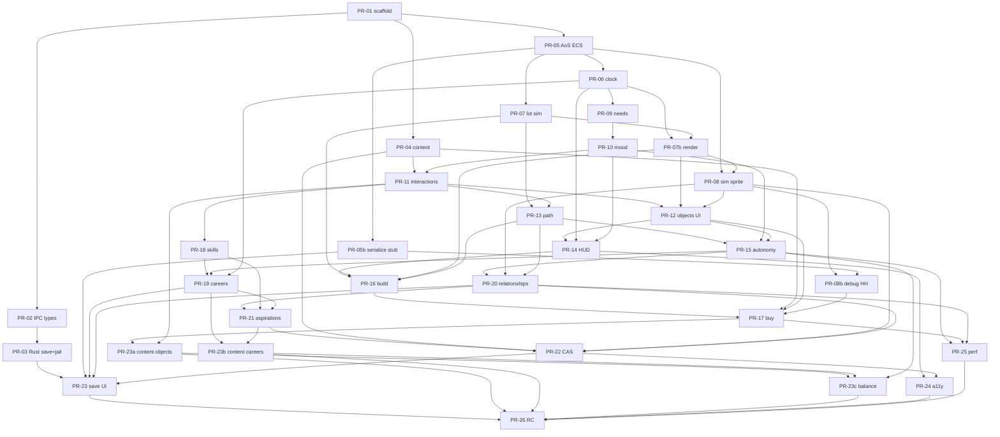

# Design Document: LifeSim — A Modern Sims-Inspired Life Simulation (Tauri + TypeScript)

| Field | Value |
|-------|--------|
| **Title** | LifeSim v1 Architecture & Development Plan |
| **Author** | Systems Architecture / TBD |
| **Date** | 2026-08-09 |
| **Status** | Draft (Rev 4 — user decisions incorporated) |
| **Codename** | LifeSim |
| **Stack** | TypeScript (game client) · Tauri 2.x (desktop shell) · Rust (host services only) |

---

## Overview

LifeSim is a greenfield desktop life-simulation game inspired by *The Sims*, delivered as a Tauri application: a webview-hosted TypeScript game client with a Rust backend for filesystem, saves, asset packing, and path-jailed resource I/O. The product goal for **v1** is not a tech demo—it is a **fully playable** single-household experience: create Sims (preset-based CAS), manage needs and moods, pursue careers and skills, build and furnish a lot, form relationships, run multi-step object interactions (e.g. cook → eat), and watch autonomous AI drive daily life, with reliable save/load and a polished live/build/buy/CAS loop.

This document defines product scope, technical architecture (process split, renderer, AoS ECS, simulation vs render, client integration), core systems (needs, slots/reservations, autonomy, careers, build/buy, world model, relationships), data/persistence, content pipeline, performance budgets, effort estimates, risks, phased delivery, **Key Decisions**, and a concrete **PR Plan**.

---

## Background & Motivation

### Why this product

Life simulation remains one of the strongest “sandbox + systems” genres: players invent stories from emergent needs, social dynamics, and environmental constraints. Open-source and indie attempts often stall at incomplete systems (needs without careers, build mode without interactions, AI that feels scripted). A modern stack—TypeScript for rapid gameplay iteration, Tauri for a small native shell and secure FS access—lets a small team ship a complete desktop game without the overhead of a full custom engine binary for every platform concern.

### Current state

Greenfield: no existing codebase. Architecture and data contracts must be established up front so systems (needs, objects, autonomy, build mode) share one entity model and one content format.

### Pain points this design addresses

| Pain | Mitigation |
|------|------------|
| Monolithic “god game loop” | AoS ECS + discrete systems with fixed sim tick |
| Content hard-coded in code | Data-driven catalogs (JSON) + typed loaders |
| Save corruption / schema drift | Versioned MessagePack saves + TS migrations + Rust atomic write |
| Web performance on multi-sim lots | PixiJS renderer, spatial indices, AI tick budgets |
| Unclear “done” for a Sims clone | Explicit v1 systems vs deferred backlog |
| Soft-locks on multi-sim object use | Use slots, reservations, approach tiles, ActionStatus UX |

---

## Goals & Non-Goals

### Goals (v1 “fully playable”)

A player can, without developer tools:

1. **Create a household** in Create-A-Sim (CAS): name, **preset-based appearance** (body/hair/outfit/skin), traits (subset), **aspiration** (minimal milestone system — see Core systems).
2. **Live on a residential lot** with day/night cycle (lighting tint), calendar (weekdays/weekends), and light weather (sunny/rain).
3. **Satisfy motives/needs** that decay over time and drive mood and behavior.
4. **Use objects** via interaction list/queue (sleep, cook chain, shower, watch TV, etc.) with **slots, path-to-approach, reservation, cancel/fail UX**.
5. **Build & buy**: place walls/rooms (simplified), floors, doors/windows, furniture from a catalog; edit while paused in build/buy mode.
6. **Careers**: join a job track, go to work (abstracted off-lot), earn money, gain promotions via performance + skills. **v1 ships exactly 2 tracks: Office Worker + Chef.**
7. **Skills**: learn through objects/actions; skills gate interactions and career outcomes (**5 skills**).
8. **Social**: multi-sim lots; **RelationshipStore** (friendship/romance); social interactions; autonomy includes social goals.
9. **Autonomy AI**: when idle, Sims pick actions from scored affordances (needs, mood, traits, relationships, free slots).
10. **Player control**: click-to-queue actions, cancel, priority; camera pan/zoom; mode switching (Live / Build / Buy / CAS).
11. **Persistence**: save/load full household + lot state; multiple save slots; crash-safe write; **serializer from early milestones**.
12. **Desktop polish**: window management, asset loading from packaged resources, installers for primary platform.

### Non-Goals (explicitly deferred)

| Deferred | Target version (indicative) |
|----------|----------------------------|
| Open world / multi-lot neighborhood travel with full NPCs | v2 |
| Story progression packs, seasons, multi-generational aging (child/elder stages) | v2+ |
| Multiplayer / cloud saves | v3 |
| Full 3D isometric with free camera orbit | Post-v1 (v1 is fixed isometric 2D sprites) |
| User-generated content marketplace / mods sandbox | v2+ (v1: optional local JSON overrides only, Zod-validated) |
| Advanced plumbing/electrical simulation, fire spreading as core loop | v1.5+ (v1: room enclosure for routing/roofs only) |
| Pets, vehicles, terrain painting, basements, multi-floor | Later (data model allows `zFloor` but content is 1 floor) |
| Full localization pipeline | v1 ships English; **`nameKey` + dictionary module** only (no full i18n framework) |
| Console ports | Out of scope |
| **Rust gameplay / pathfinding in v1** | Non-goal for host; measure TS budgets first; no premature Rust offload |
| Auto-updater | Non-goal for v1 — manual releases |
| Parametric body morphs / layered clothing editor | Non-goal; **preset swap only** |
| Pregnancy / babies | Non-goal; romance meters only |
| Controller support | Non-goal; KBM only |

### Success criteria (v1)

- **Play session**: 30–60 minutes of coherent gameplay without soft-locks.
- **Performance**: 60 FPS UI/render on reference hardware with up to **8 Sims** + **~400 placeable objects** on one lot; sim clock at **Clock Contract** rates (1× = 1 tick/real second) with catch-up cap.
- **Completeness**: all Goals above; **2 career tracks (Office Worker + Chef)**; **5 skill types**; **≥40 catalog objects** (placeholder art acceptable for “playable”; shippable art is a separate gate); **5+ traits**; **≥1 full cook→eat chain**; full save/load round-trip; CAS with **≥2 body × 2 outfit presets**, **4 facings**, walk + idle anims.
- **Playable vs shippable**: *Playable* = systems complete + geometric/placeholder art. *Shippable* = art/audio pass + balance + installer QA on primary platform.

### Effort assumptions (see Appendix A)

Assumes **2–3 engineers** + part-time art; **~6–9 calendar months** to playable RC with placeholders. See **Appendix A: Effort estimates**.

---

## Key Decisions

| # | Decision | Rationale |
|---|----------|-----------|
| K1 | **Tauri 2.x** shell; **all gameplay in TypeScript**; Rust = FS, saves, path-jailed assets only | Fast iteration; **no Rust gameplay in v1** (including pathfinding) |
| K2 | **PixiJS v8** for 2D WebGL (not Phaser, not Canvas-only) | Scene graph + atlases; we own game loop/ECS |
| K3 | **AoS entity-record ECS** (custom thin world or **miniplex**-style): entities as records / Map stores; **not pure bitECS SoA** for v1 | Sim state is string-heavy and variable-length (queues, names, relationship edges, slot reservations). SoA bitECS would force awkward side tables for almost everything that matters. Revisit SoA only if tick profiling proves hot numeric loops are the bottleneck |
| K4 | **Fixed simulation tick** per **Clock Contract** below; decoupled from RAF | Sims-like pacing; AI budgets; stable saves |
| K5 | **Data-driven content**: JSON for objects, interactions, careers, traits, aspirations; TS handlers by ID | Designers edit data; code owns branching logic |
| K6 | **Single active lot** in v1; neighborhood is menu/map only | Scope cut; careers use abstract “at work” |
| K7 | **Isometric 2D diamond tiles** | Genre-readable without 3D pipeline |
| K8 | **Utility AI / scored affordances** (not GOAP, not pure need-threshold FSM) | Authorable ads; threshold FSM too flat for social+mood; GOAP deferred |
| K9 | **Save body: MessagePack only** (`@msgpack/msgpack`) + JSON sidecar **meta** only; versioned schema; migrations in **TS**; Rust atomic write | Compact ship format; one codec—no CBOR dual path. Dev may dump JSON via debug flag for inspection, not as primary format |
| K10 | **Zustand** for UI/HUD projections (not Valtio); ECS is world source of truth | Simple API; thin adapters; reject Valtio to freeze one store |
| K11 | **React** for HUD/menus/CAS; **Pixi** for world canvas | Form-heavy UI vs perf world |
| K12 | **Pathfinding**: A\* on sim navgrid; recompute on build edits; path may span multiple ticks | Standard; no hierarchical PF in v1 |
| K13 | **Age stage v1 = `adult` only** | Avoid child/elder content explosion |
| K14 | **v1 careers = Office Worker + Chef only** (2 tracks) | Frozen product choice; variety without three full ladders |
| K15 | **Aspirations = minimal milestones in v1** (not deferred) | Goal 1 requires them; keep scope tiny (see Core systems) |
| K16 | **Primary ship target: Windows 10+ (WebView2)**; macOS/Linux best-effort | Matches author environment; RC checklist includes Win installer |

---

## Proposed Design

### High-level architecture



### Process split: Rust vs TypeScript

| Responsibility | Owner | Notes |
|----------------|-------|-------|
| Window, menus, OS integration | Rust / Tauri | Standard Tauri 2 |
| Read/write save files, atomic rename | Rust | `save_game`, `load_game`, `list_saves` |
| Asset bytes from **fixed resource root** | Rust | Path jail; no `..`; no absolute user paths in `get_asset` |
| All simulation (needs, AI, time, careers, pathfinding) | TypeScript | Single-threaded; **no Rust gameplay in v1** |
| Rendering, world hit-test, camera | TypeScript + Pixi | |
| Content validation at build time | Node + Zod | CI `content:check` + handler orphan check |

**IPC surface:**

```typescript
// packages/shared/src/tauri-api.ts
export type SaveSlotMeta = {
  id: string;
  name: string;
  householdName: string;
  playTimeSeconds: number;
  schemaVersion: number;
  updatedAt: string; // ISO
};

export type TauriCommands = {
  list_saves: () => Promise<SaveSlotMeta[]>;
  /** MessagePack body only (SaveGameV*). */
  load_game: (id: string) => Promise<Uint8Array>;
  save_game: (id: string, meta: SaveSlotMeta, body: Uint8Array) => Promise<void>;
  delete_save: (id: string) => Promise<void>;
  /**
   * Load asset relative to app resource root.
   * Rejects absolute paths, `..`, and escapes outside resource dir.
   * Prefer Tauri asset protocol for static packs when possible.
   */
  get_asset: (relativePackPath: string) => Promise<Uint8Array>;
  get_app_paths: () => Promise<{ saves: string; userContent: string }>;
};
```

Rust must not embed game rules. Serialization of the world happens in TS; Rust only persists bytes + metadata.

**Asset / capability rules (Security):**

1. Resolve `relativePackPath` with normalization; reject if any segment is `..` or path is absolute.
2. Canonical path must stay under `$RESOURCE/packs` (or equivalent).
3. Tauri 2 **capabilities**: FS scope limited to app data (saves) + resource dir; no full-disk.
4. **CSP** in webview: default-src self; no remote script; assets via custom protocol or jailed IPC.
5. v1 **userContent**: JSON overrides only (objects/traits), Zod-validated; never executable; never binary code load from userContent.
6. Prefer bundling core content in app resources; `get_asset` is for large/optional packs, not open-ended FS.

### Rendering approach

- **Engine**: PixiJS v8 (WebGL; WebGPU when available).
- **Projection**: Isometric diamond map; lot **40×40** starter, **64×64** max v1; **one floor** of content.
- **Layers** (bottom → top): terrain/floor → walls (depth-sorted) → objects (depth-sorted) → Sims (depth-sorted) → overlays (selection, grid, roof fade) → day/night tint filter.
- **Camera**: pan (WASD/middle-mouse), zoom (wheel, clamped), optional follow selected Sim.
- **Sprites**: texture atlases; multi-tile objects; modular wall segments.
- **Not Phaser / not full 3D**: as Key Decisions.

#### Y-sort / depth algorithm (v1 painter’s algorithm)

Isometric depth uses a **tile metric** plus layer bias. Documented limitations acceptable for v1 (no perfect occlusion for all multi-tile edge cases).

```text
// Tile coordinates: x east, y south (integer grid)
// Footprint anchor = south-east corner of footprint (max x+w-1, max y+h-1) for solid objects
// Sims use current tile (floor(x), floor(y))

depthKey(entity) =
  (anchorX + anchorY) * DEPTH_SCALE          // primary: farther south-east draws later
  + layerBias                                // floor=0, wall=100, object=200, sim=300, overlay=400
  + footprintTieBreak                        // larger footprints slightly later when anchors equal
  + entityId * EPSILON                       // stable tie-break

// Walls: stored as edge segments between tiles; split long walls into per-edge chunks
// each chunk sorted by (tileA.x + tileA.y + tileB.x + tileB.y) / 2

// Roof fade: when camera "walls down" or room selected, wall segments with
// roomId === selectedRoom and edge on interior get alpha 0.35
```

**Acceptance cases for sort tests/screenshots:**

1. Sim standing in doorway (should not draw fully behind both wall chunks incorrectly).
2. 2×2 table with Sim on north vs south side.
3. Two Sims overlapping same depthKey → entityId order stable.

**Multi-tile objects:** sprite origin at footprint anchor; child tiles contribute to placement/collision only.

### Entity model (AoS ECS)

**Primary model (K3):** Array-of-structures / entity records.

```typescript
// packages/sim/src/world.ts — conceptual
type EntityId = number;

type World = {
  nextId: EntityId;
  /** Dense-ish record map; deleted ids recycled or generation-tagged optional v1.1 */
  entities: Map<EntityId, EntityRecord>;
  /** Pairwise social graph — not a component on a single Sim */
  relationships: RelationshipStore;
  lot: LotState;           // authoritative grid (pure sim)
  household: HouseholdState;
  clock: ClockState;
  /** Full stream state — both seed and state persisted (see Determinism / SaveGameV1). */
  rng: RngState;           // { seed: number; state: number } mulberry32
  mode: 'live' | 'build' | 'buy' | 'cas';
  weather: 'sunny' | 'rain';
  /** Player/UI selection — mutated only via SimCommands; projected to HudProjection. */
  ui: WorldUiState;
  eventBus: SimEvent[];    // drained end-of-tick into UI projections
};

type RngState = {
  seed: number;   // original new-game seed (for display/debug)
  state: number;  // current mulberry32 state; advanced on every next()
};

type WorldUiState = {
  selectedSimId: EntityId | null;
  /** Context target for interaction menu (object or other Sim); not the selected/controlled Sim. */
  targetEntityId: EntityId | null;
  hoverEntityId: EntityId | null;
  /** Build/buy tool id when mode is build/buy, else null */
  modeTool: string | null;
  /** Buy-mode ghost preview (not an entity until placed) */
  buyGhost: null | { defId: string; x: number; y: number; rot: 0|1|2|3 };
};

type EntityRecord =
  | { kind: 'sim'; ...SimComponents }
  | { kind: 'object'; ...ObjectComponents };

// Hot-ish numeric fields live on the record; no SoA split required for v1
interface SimComponents {
  id: EntityId;
  transform: { x: number; y: number; zFloor: number; facing: 0|1|2|3 };
  identity: { firstName: string; lastName: string; ageStage: 'adult' }; // v1 adult only
  visual: SimVisual;
  anim: AnimState;
  needs: Needs;
  mood: { value: number; modifiers: MoodModifier[] };
  skills: Record<string, number>; // 0–10
  traits: { ids: string[] };
  aspiration: AspirationState;
  career: CareerState;
  inventory: InventoryState; // held items (meal plate, etc.)
  queue: InteractionQueue;
  action: ActionRuntime; // current ActionStatus
  path: PathAgent;
  autonomy: { nextPlanTick: number; cooldownUntil: number };
  presence: 'on_lot' | 'at_work'; // WorkAbstract
  /** Non-object social pairing lock (see Social approach). */
  socialLock: null | { partnerId: EntityId; untilTick: number; role: 'initiator' | 'partner' };
}

interface ObjectComponents {
  id: EntityId;
  transform: { x: number; y: number; zFloor: number; rot: 0|1|2|3 };
  defId: string;
  quality: number;
  dirtiness: number;
  /** v1: no power grid. Default true on place unless ObjectDef.startsPowered === false. */
  powered: boolean;
  /** Visual/logic state id from ObjectDef.states, e.g. "default" | "open". */
  state: string;
  footprint: { w: number; h: number };
  /** Runtime slot occupancy */
  slots: SlotRuntime[];
  /** Optional in-progress multi-step state (recipe on stove, etc.) */
  crafting?: CraftingState;
}

/** Runtime crafting on an object instance (persisted in lot.objects). */
type CraftingState = {
  chainId: string;
  stageId: string;                 // author-defined stage within chain
  ownerSimId: EntityId | null;     // Sim who started / owns the craft
  ticksRemaining: number;          // 0 = ready for next interaction; >0 if timed stage
  outputHeldItem?: string;         // def id granted when stage completes (optional)
};

/** Content-side partial applied by chain.setObjectCrafting on success. */
type CraftingStateTemplate = {
  chainId: string;
  stageId: string;
  ticksRemaining?: number;         // default 0
  outputHeldItem?: string;
  /** If true, ownerSimId = acting Sim; if false, ownerSimId = null (shared station). Default true. */
  captureOwner?: boolean;
};

interface SimVisual {
  bodyPreset: string;   // e.g. "body_a"
  hairPreset: string;
  outfitPreset: string;
  skinTone: string;     // palette id
}

/** Animation presentation — driven by path + action */
interface AnimState {
  clip: 'idle' | 'walk' | 'sit' | 'use' | 'pass_out';
  frame: number;
  facing: 0|1|2|3; // synced from transform when walking
}
```

**Save mapping (authoritative layout):**

| Live world | SaveGameV1 field | Notes |
|------------|------------------|-------|
| Sim entities | `entities.sims[]` | Full sim runtime (queue, action, inventory, aspiration, socialLock, …) |
| Object entities | **`lot.objects[]`** | Not under `entities`; includes slots, state, powered, crafting |
| RelationshipStore | `relationships[]` | Flat edge list |
| Lot geometry | `lot` floor/walls/doors/windows | **Derived caches not stored** |
| RNG | `rng: { seed, state }` | Full stream position — not seed alone |
| UI selection | *not saved* | Reset on load (`targetEntityId = null`) |
| Household/clock/weather | top-level fields | |

**Load pipeline (mandatory after hydrate):**

```text
1. Decode MessagePack → plain SaveGameV1
2. Run migrations to CURRENT schema
3. Rebuild entities Map from entities.sims; spawn object entities from lot.objects
4. Rebuild RelationshipStore from relationships[]
5. Restore world.rng = { seed, state }  // do NOT reseed from seed only
6. recomputeLotDerived(lot, objectEntities)
     → recomputeWalkable (walls + doors passage; windows never open passage)
     → apply object footprints to walkable
     → floodFillRooms
     → rebuild objectsAt spatial hash
7. Clear world.ui selection/hover; validate each sim action target still exists
```

No SoA packing step.

### Authoritative lot / grid model (pure sim)

All walkability, placement, and rooms live in `packages/sim` — **never** in `packages/render`.

```typescript
type LotState = {
  id: string;
  width: number;
  height: number;
  floors: 1; // v1 content
  /** floor cover id per cell index = y * width + x */
  floorCover: Uint16Array;
  /** edge walls: horizontal edges (height+1)*width + vertical edges height*(width+1) bitsets or sparse list */
  walls: WallEdgeStore;
  doors: DoorEdge[]; // subset of walls with passage — opens walkability through that edge
  windows: WindowEdge[]; // decorative only: NEVER carve walkability / never act as passage
  /** Derived caches — rebuilt on build edits AND on every deserialize (not persisted) */
  walkable: Uint8Array; // 1 = walkable
  roomOfCell: Int16Array; // room id or -1 outdoor
  entryMarkers: GridPos[]; // spawn / return-from-work
  objectsAt: Map<number, EntityId[]>; // cell → object ids spatial hash
};

// Rebuild pipeline (pure functions, Vitest) — also invoked by recomputeLotDerived on load:
// setWall/setDoor → recomputeWalkable (doors open passage; windows ignored for nav)
//   → stamp object footprints → floodFillRooms → rebuild objectsAt → invalidatePaths
```



**Floor vs walls vs footprints:**

| Layer | Storage | Affects nav? |
|-------|---------|--------------|
| Floor cover | cell array | No (cosmetic / outdoor tag) |
| Wall edges | edge store | Yes — blocks unless **door** |
| Windows | edge store | **No** — never open passage |
| Object footprint | on object entity | Yes if `blocksPath` |
| Approach tiles | on ObjectDef.slots | Path target; not blocked by object center; must be in-bounds + walkable on place |

### Object slots, reservation, approach tiles

Critical for multi-sim “fully playable” use.

```typescript
// In ObjectDef (content JSON)
type ObjectSlotDef = {
  id: string;              // "seat_0", "use_front"
  offset: { x: number; y: number }; // relative to object origin, rotated with object
  facing: 0|1|2|3;         // facing Sim should have when using
  tags: string[];          // "sit", "sleep", "cook", "toilet"
  exclusive: boolean;      // default true
};

// Runtime on object instance
type SlotRuntime = {
  slotId: string;
  reservedBy: EntityId | null;
  reservedUntilTick: number; // 0 if free; hold through action end
};

// InteractionDef references:
// slotTag: "sleep" → find free slot with tag on target object
// approach: stand on slot world cell (object origin + rotated offset)
```

**Reservation rules:**

1. On action start (after path success): reserve slot; fail with `failed: slot_taken` if exclusive and held.
2. Hold until action `succeeded` / `failed` / cancel.
3. **Priority:** player-queued actions may wait in queue; autonomy must not steal reserved slots (score only free slots).
4. **Invalidation:** if object moved/sold/deleted → all queue items targeting it → `failed: target_invalid`; clear reservations; toast.
5. **Two Sims, one fridge:** second gets `slot_taken` or routes to alternate object with same interaction tags.

**Catalog example with slots:**

```json
{
  "id": "object.fridge_basic",
  "nameKey": "objects.fridge_basic.name",
  "category": "appliances",
  "price": 400,
  "footprint": { "w": 1, "h": 1 },
  "blocksPath": true,
  "tags": ["food_source", "electronics"],
  "outdoor": false,
  "sprites": { "atlas": "objects", "frame": "fridge_basic" },
  "slots": [
    { "id": "use_front", "offset": { "x": 0, "y": 1 }, "facing": 0, "tags": ["use"], "exclusive": true }
  ],
  "interactions": ["interact.fridge_snack", "interact.fridge_start_meal"],
  "states": ["default", "open"]
}
```

### Action status, interruption, fail UX

```typescript
type ActionFailReason =
  | 'cancelled_by_player'
  | 'path_impossible'
  | 'path_max_failures'
  | 'slot_taken'
  | 'target_invalid'
  | 'chain_target_unavailable' // next chain step has no valid target
  | 'requirements_unmet'
  | 'preempted_need_critical'
  | 'preempted_work_schedule'
  | 'object_busy'
  | 'partner_left'            // social partner walked away / left lot
  | 'energy_collapse'; // pass out

type ActionStatus =
  | { phase: 'pending' }
  | { phase: 'pathing'; attempt: number }
  | { phase: 'performing'; ticksLeft: number; slotId?: string }
  | { phase: 'succeeded' }
  | { phase: 'failed'; reason: ActionFailReason };

// QueuedAction carries interactionId, targetId, optional chainToken, status
```

**Rules:**

| Event | Behavior |
|-------|----------|
| Player cancel | Current → `cancelled_by_player`; clear reservation; **`clearSocialPair(sim)`**; next queue item |
| Path fail | Retry up to 2 repaths; then `path_impossible` / `path_max_failures`; autonomy cooldown 30 ticks; **`clearSocialPair` if social** |
| Critical energy (0) | Preempt non-critical queue; pass out; `energy_collapse`; **`clearSocialPair`** |
| Critical bladder | Preempt fun/social (social → fail `preempted_need_critical` + **`clearSocialPair`**); boost toilet ads |
| Work shift start | Fail current with `preempted_work_schedule`; clear queue; **`clearSocialPair` on this Sim**; transition `at_work` (see careers) |
| Action success | Apply outcomes; release object slots; **`clearSocialPair` if social** |
| Skill gate | Never enqueue; UI tooltip `requirements_unmet` |
| Soft-lock recovery | Player cancel always works; debug teleport to entry marker (dev only) |

UI: toast + queue icon state colors (pathing / failed reason string from `nameKey`).

**`clearSocialPair(sim)` (mandatory helper):** If `sim.socialLock != null`, set `partner = entities[sim.socialLock.partnerId]`; if partner exists and `partner.socialLock?.partnerId === sim.id`, set `partner.socialLock = null`; set `sim.socialLock = null`. Idempotent. Called on **every terminal** ActionStatus for social interactions (`succeeded`, `failed:*`, cancel) and whenever a Sim is removed from social eligibility (work, pass out).

### Multi-step interaction chains

v1 supports **chains** for cooking and similar:

```typescript
type InteractionDef = {
  id: string;
  labelKey: string;
  durationTicks: number;
  advertises: Partial<Needs>;
  slotTag?: string;
  /** Object-only; omit for social interactions (target is always a Sim). */
  targetKind?: 'object' | 'sim'; // default 'object'
  requires?: {
    skills?: Record<string, number>;
    traits?: string[];
    heldItem?: string;      // inventory def id
    objectState?: string;
  };
  /**
   * Chain handoff after THIS interaction succeeds.
   * autoEnqueueNext default true: push next step onto the same Sim's queue immediately.
   * If false, only world/inventory/crafting state is updated; player or autonomy must pick next.
   */
  chain?: {
    chainId: string;
    nextInteractionId?: string;     // same or other object (resolved by findBestChainTarget)
    autoEnqueueNext?: boolean;      // default true
    spawnHeldItem?: string;         // e.g. item.raw_meal / item.ingredients
    setObjectCrafting?: CraftingStateTemplate; // applied to *current* target object
    clearObjectCrafting?: boolean;  // clear crafting on current target after success
    clearHeldItem?: boolean;
    /** Tags the *next* target object must have (ObjectDef.tags). Used by findBestChainTarget. */
    requireSurfaceTags?: string[];
  };
  outcomes: {
    needsDelta?: Partial<Needs>;
    skillXp?: Record<string, number>;
    fundsDelta?: number;
    moodBuffs?: { id: string; durationTicks: number }[];
    spawnObject?: string;
    /** Flip object.state on success (v1 primary state transition path). */
    setObjectState?: string;
  };
  handlerId?: string;
};
```

#### Chain target resolution (`findBestChainTarget`)

When step N succeeds and `chain.nextInteractionId` is set:

```text
function findBestChainTarget(sim, nextInteractionId, chain, previousTargetId): EntityId | null
  nextDef = content.interactions[nextInteractionId]
  candidates = all on-lot object entities where:
    - object offers nextInteractionId (def.interactions includes it)
    - object.powered is true if interaction requires power (default: requires powered unless def.ignorePower)
    - if nextDef.requires.objectState: object.state matches
    - if chain.requireSurfaceTags: ObjectDef.tags ⊇ requireSurfaceTags
    - if nextDef.slotTag: object has a free exclusive slot with that tag
       (or non-exclusive slot always ok)
    - if nextDef.requires.heldItem: sim.inventory.held matches (already true post prior outcomes)
    - approach cell for chosen slot is in-bounds and walkable (after current lot derived)
    - pathExists(sim.tile → approach)  // use cached reachability / A* probe; fail candidate if not

  if candidates empty: return null

  // Deterministic best: nearest by path length (tiles), tie-break lower EntityId
  score each candidate:
    pathLen = length of A* to approach (or Manhattan if probe deferred — prefer real pathLen)
  return min by (pathLen, entityId)
```

**Handoff policy on success of step N:**

1. Apply `outcomes` (needs, XP, `setObjectState`, `spawnHeldItem` / held updates, `setObjectCrafting` / `clearObjectCrafting` on **previous** target).
2. Release slot reservation on previous target.
3. If no `nextInteractionId`: stop (chain complete).
4. `targetId = findBestChainTarget(...)`.
5. If `targetId === null`:
   - Emit fail toast with `chain_target_unavailable`.
   - **Do not** fail the completed step (it already succeeded).
   - Leave **held item and crafting state intact** so player/AI can retry later.
   - Do not auto-enqueue.
6. If `targetId` found and `autoEnqueueNext !== false`:
   - `enqueueInteraction(sim, nextInteractionId, targetId)` as `pending` (may immediately path).
7. If `autoEnqueueNext === false`: leave state only; autonomy may advertise the next interaction via normal gather.

**Same-object chains:** If the only valid candidate is `previousTargetId` (e.g. multi-stage same appliance), that is fine — resolution still runs the full filter.

**Example (fridge → stove → table):**

```text
interact.fridge_start_meal
  outcomes/spawnHeld: item.ingredients
  chain: { chainId: "cook_meal", nextInteractionId: "interact.stove_cook",
           requireSurfaceTags: ["cooking_surface"], autoEnqueueNext: true }

interact.stove_cook
  requires.heldItem: item.ingredients
  chain: { setObjectCrafting: { chainId, stageId: "cooking", ticksRemaining: 0 },
           spawnHeldItem: item.plated_meal, clearHeldItem handled by swap,
           nextInteractionId: "interact.table_eat",
           requireSurfaceTags: ["dining_surface"], clearObjectCrafting: true }

interact.table_eat
  requires.heldItem: item.plated_meal; slotTag: "sit"
  outcomes: hunger+; clearHeldItem
  // no nextInteractionId
```

**PR-11 Vitest:** two stoves at different distances → fridge success auto-enqueues stove_cook on **nearest path-reachable** free stove (deterministic EntityId tie-break).

**Inventory (v1 MVP):** Sim `inventory.held: { defId: string } | null` — one carried item. Household funds are on `HouseholdState.funds`, not inventory.

### Object state & powered (v1)

| Field | Rule |
|-------|------|
| `powered` | **Always `true` on place** unless `ObjectDef.startsPowered === false`. No power grid / meters in v1. Interactions that need power check `object.powered`; unpowered → `requirements_unmet` / disabled in menu. |
| `state` | Initial = `ObjectDef.states[0]` or `"default"`. Transitions **only** via `outcomes.setObjectState` or a registered `handlerId` — no implicit FSM. |
| `states` in catalog | Declarative list for validation (`open` must be listed before set). |

### Social approach & adjacency

Social interactions (`targetKind: 'sim'`) do **not** use object slots. Routing contract:

```text
Social approach:
  1. Target must have presence === on_lot and not at_work and socialLock == null.
  2. Path to any walkable 4-neighbor (or 8-neighbor Chebyshev ≤1) cell of target's current tile
     that is not blocked; prefer cell that faces target (lowest turn cost), tie-break lower cell index.
  3. On arrival: set initiator facing toward partner; set both socialLock
     { partnerId, untilTick: now + durationTicks, role }.
  4. Partner: if idle/autonomy, interrupt to idle-in-place (do not walk away); if partner has
     player-critical queue, social may still proceed as long as partner remains Chebyshev ≤1.
  5. Each tick while performing: if Chebyshev distance > 1 for > 2 consecutive ticks
     OR partner presence !== on_lot OR partner entity deleted → fail partner_left / target_invalid;
     then clearSocialPair(initiator)  // clears both if mutual
  6. Simultaneous social: a Sim with socialLock cannot be targeted by a second social
     (affordance filtered); UI "Busy" via object_busy / requirements_unmet.
  7. Autonomy gatherAffordances includes social candidates:
     for each other on-lot Sim with socialLock == null, for each social InteractionDef
     meeting relationship gates, add candidate { interactionId, targetId: otherSim }.
```

#### `socialLock` lifecycle (required — prevents permanent autonomy soft-lock)

| Terminal / event | Clears locks? |
|------------------|---------------|
| Social action **`succeeded`** (InteractionProgress complete) | **Yes** — `clearSocialPair(initiator)` |
| Social action **`failed`** for any reason (`partner_left`, `cancelled_by_player`, `preempted_work_schedule`, `preempted_need_critical`, `energy_collapse`, path fails, `target_invalid`, …) | **Yes** — `clearSocialPair` on the Sim whose action terminated (clears mutual pair) |
| Player **cancel** current or queued social (if lock already held) | **Yes** |
| **CareerScheduleSystem** shift start (`at_work`) | **Yes** — `clearSocialPair` on departing Sim **before** presence flip (partner must become autonomy-eligible) |
| Partner is the one sent to work / cancelled while initiator still performing | Partner’s transition runs `clearSocialPair(partner)` which clears initiator too if mutual |
| **`untilTick < world.tick`** still held (clock skew / missed terminal) | **Yes** — FailsafeSystem each tick: if `socialLock && socialLock.untilTick < tick` → `clearSocialPair(sim)` (safety net) |
| Object slot release | N/A (different system); social uses the same “release on any terminal” rigor as slots |

**Invariant:** After any social interaction reaches a terminal ActionStatus, **both** Sims have `socialLock === null` (unless immediately re-locked by a new social that same tick — not allowed; clear runs before AutonomySystem). Autonomy requires `socialLock == null`.

PathSystem treats social targets as **approach-to-adjacency** rather than object slot cells.

**PR-20 tests (required):**

1. Happy path: chat completes → both `socialLock == null`; both autonomy-eligible next plan tick.  
2. Player cancel mid-chat → both locks null.  
3. Work preempt mid-chat on initiator → both locks null; initiator `at_work`.  
4. Partner walks out of range → `partner_left`; both locks null.  
5. Failsafe: force `untilTick` in the past → next tick clears both.

### Presentation model (CAS / animation)

v1 CAS is **preset swap only** (no parametric morphs).

**Sprite naming:** `{bodyPreset}_{outfitPreset}_{clip}_{facing}_{frame}`  
Example: `body_a_casual_walk_2_03.png` in atlas `sims`.

**Acceptance:** ≥2 body presets × ≥2 outfits; 4 facings; clips `idle` + `walk` minimum; `use`/`sit` can reuse idle with prop SFX if art-thin.

`AnimState` updates:

- `path` non-empty → `walk`
- `performing` + slot tag sit/sleep → `sit`
- else `idle`
- energy collapse → `pass_out`

### Client integration (React ↔ ECS ↔ Pixi)

**Hard rules:**

1. **`SimCommands`** is the **sole mutator** API for player/UI/debug. React never writes ECS fields or `world.ui` directly.
2. **`SimQueries` / projections**: end of each sim tick **and immediately after any SimCommand** (so menus feel instant when paused), push a **small** `HudProjection` into Zustand. **No per-RAF full-world clone.**
3. **Pixi** owns world pointer events (hit-test topmost depthKey under cursor among Sims/objects). React owns HUD chrome; when pointer is over HUD (`pointer-events`), canvas ignores.
4. **`InputRouter`** switches tools by `world.mode` + `world.ui.modeTool`: Live (select/queue), Build (wall tool), Buy (ghost place), CAS (no lot tools).
5. **`packages/sim` imports no React, no Pixi, no DOM** — enforced by ESLint boundary.
6. **Selection lives in `world.ui`**, not only in Zustand: picks call `SimCommands.setWorldTarget` / `selectSim`; projection mirrors them. Build ghost may live in `world.ui.buyGhost` so serialize can ignore it consistently.

```mermaid
sequenceDiagram
  participant User
  participant Pixi
  participant Router as InputRouter
  participant Cmd as SimCommands
  participant World as ECS World
  participant Q as SimQueries
  participant Z as Zustand
  participant React as Live HUD

  User->>Pixi: click fridge sprite
  Pixi->>Router: pick(entityId=fridge)
  Router->>Cmd: setWorldTarget(fridge)
  Cmd->>World: ui.targetEntityId = fridge
  Cmd->>Q: projectNow()
  Q->>Z: HudProjection with target.availableInteractions
  Z->>React: open/update context menu
  User->>React: choose "Grab snack"
  React->>Cmd: enqueueInteraction(selectedSim, interact.fridge_snack, fridge)
  Cmd->>World: queue pending; validate requirements
  loop sim ticks
    World->>World: pathing → reserve slot → performing → outcomes
    World->>Q: end-of-tick projection
    Q->>Z: set selected queue/needs
    Z->>React: re-render queue panel
  end
```

```typescript
// packages/sim/src/api/commands.ts — sole mutation surface
interface SimCommands {
  setSpeed(speed: 0 | 1 | 2 | 3): void;
  selectSim(id: EntityId): void;
  /** Context target for interaction menu (object or other Sim). null clears. */
  setWorldTarget(id: EntityId | null): void;
  setHover(id: EntityId | null): void;
  clearTarget(): void;
  enqueueInteraction(simId: EntityId, interactionId: string, targetId: EntityId): Result;
  cancelQueued(simId: EntityId, index: number): void;
  cancelCurrent(simId: EntityId): void;
  enterMode(mode: 'live' | 'build' | 'buy' | 'cas'): void;
  setModeTool(toolId: string | null): void;
  placeObject(defId: string, x: number, y: number, rot: number): Result;
  moveObject(id: EntityId, x: number, y: number, rot: number): Result;
  deleteObject(id: EntityId): Result;
  setWall(edge: EdgeRef, present: boolean): Result;
  setFloor(x: number, y: number, coverId: number): Result;
  newGame(household: HouseholdCreateDto): void;
  debugSpawnHousehold(preset: 'solo' | 'duo'): void; // dogfood before full CAS
  serializeWorld(): Uint8Array;
  deserializeWorld(data: Uint8Array): void;
}

// packages/sim/src/api/queries.ts — read model for UI
interface AvailableInteraction {
  id: string;
  labelKey: string;
  enabled: boolean;
  failReasonKey?: string; // e.g. requirements_unmet, slot_taken
}

interface HudProjection {
  tick: number;
  clock: { day: number; minuteOfDay: number; dayOfWeek: number };
  speed: 0|1|2|3;
  mode: World['mode'];
  modeTool: string | null;
  weather: World['weather'];
  funds: number;
  /** Portrait strip — all household members */
  householdSims: {
    id: EntityId;
    name: string;
    mood: number;
    presence: 'on_lot' | 'at_work';
    selected: boolean;
  }[];
  selectedSim: null | {
    id: EntityId;
    name: string;
    needs: Needs;
    mood: number;
    queue: { id: string; labelKey: string; status: ActionStatus }[];
    career: CareerState;
    aspiration: { defId: string; progress: number; milestoneIndex: number };
    heldItem: string | null;
  };
  /** Context menu target from world.ui.targetEntityId */
  target: null | {
    id: EntityId;
    kind: 'sim' | 'object';
    defId?: string; // objects
    nameKey: string;
    availableInteractions: AvailableInteraction[];
  };
  toasts: { id: string; messageKey: string; params?: Record<string, string> }[];
}

// availableInteractions computed by pure helper listInteractions(world, selectedSimId, targetId)
// using skill/slot/powered/state/held/relationship gates — same helper as enqueue validation.
```

Build/buy: `enterMode('build'|'buy')` sets speed 0 (pause) and swaps InputRouter toolset; live resumes previous speed on return (stored).

### Systems order (per sim tick)

Order is intentional for preemption and mood-aware autonomy:

1. **`TimeSystem`** — advance clock; fire schedule edges (shift start/end); update weather roll if any  
2. **`CareerScheduleSystem`** — on shift start: preempt queues, set `presence: at_work`, hide from lot; on return: spawn at entry, apply pay/performance  
3. **`NeedDecaySystem`** — decay × traits × weather outdoor flag; at-work slower decay  
4. **`MoodSystem`** — recompute mood from needs + buffs **before** autonomy  
5. **`InteractionProgressSystem`** — advance performing; apply outcomes; chain handoff; release slots; on social terminal → **`clearSocialPair`**  
6. **`PathSystem`** — step paths; on arrival flip to performing + reserve slot / set socialLock  
7. **`AutonomySystem`** — idle on-lot Sims only with `socialLock == null`; uses **post-mood** values; staggered  
8. **`RelationshipDecaySystem`** — slow drift; social memory flags  
9. **`FailsafeSystem`** — pass out at energy 0 (`clearSocialPair`); abandon stuck pathing; **expire `socialLock` if `untilTick < tick`**  

**Render frame (RAF):** interpolate walk t between ticks optional; sync Pixi from transform/anim; apply day/night tint from `minuteOfDay`; cull; Y-sort draw list.

### Clock Contract

Single source of truth for time:

| Constant | Value | Meaning |
|----------|-------|---------|
| `TICK_GAME_MINUTES` | `1` | Each sim tick advances 1 in-game minute |
| `GAME_DAY_TICKS` | `1440` | 24 × 60 |
| `BASE_TICKS_PER_REAL_SECOND` | `1` | At speed **1×**, 1 tick per real second |
| `SPEED_MULT` | `{0:0, 1:1, 2:2, 3:3}` | Ticks per real second ≈ base × mult |
| `MAX_CATCH_UP_TICKS_PER_FRAME` | `5` | Avoid spiral of death |
| `AUTOSAVE_REAL_MS` | `300_000` | 5 real minutes |

**Derived:**

- 1 game hour = 60 ticks = **60 real seconds** at 1×.  
- 1 game day = 1440 ticks ≈ **24 real minutes** at 1×; ≈ **8 real minutes** at 3×.  
- Career **Mon–Fri 09:00–17:00** = dayOfWeek in `0..4`, `minuteOfDay ∈ [9*60, 17*60)`.  
- Pause (`speed=0`): **zero ticks**; clock frozen.

**Need decay formula:**

```text
needRatesPerGameHour = { hunger: 12, energy: 8, hygiene: 5, fun: 7, social: 6, bladder: 10 } // tunable
deltaPerTick = rate / 60   // because TICK_GAME_MINUTES = 1
// outdoor + rain: fun extra −0.05/tick when Sim on outdoor cell
```

Success criteria “1 Hz logical” means **1× → 1 tick/real second**, not a second competing definition.

### Day/night, calendar, weather hooks

- `minuteOfDay` ∈ [0, 1440).  
- **Lighting:** render applies multiply tint: night (0–360, 1200–1440) cool dark blue; dawn/dusk lerp; day neutral. Implemented as Pixi ColorMatrix/filter from clock — no separate sim system required beyond exposing clock.  
- **Calendar UI:** day number + weekday label in HUD.  
- **Weather:** `world.weather`; rain sets outdoor objects’ fun ads down and `NeedDecay` outdoor penalty; cosmetic rain layer optional.  
- Weekend: `dayOfWeek` 5–6 → career schedule skips work.

### Core simulation systems

#### Needs / motives

| Need | Rate / game hour | Critical effects |
|------|------------------|------------------|
| Hunger | 12 | Mood penalty; seek food |
| Energy | 8 | Pass out → floor sleep |
| Hygiene | 5 | Social penalty |
| Fun | 7 | Mood; seek entertainment |
| Social | 6 | Seek Sims / abstract phone |
| Bladder | 10 | Preempt queue for toilet |

Values 0–100. Mood = weighted needs + active `MoodModifier[]` (expiry tick).

#### Skills (v1 set)

Cooking, Charisma, Logic, Handiness, Fitness — data-driven XP tables; gate interactions.

#### Careers (2 tracks — frozen)

v1 ships **only** these two data-defined tracks (content IDs e.g. `career.office_worker`, `career.chef`):

| Track | Focus skills (illustrative) | Notes |
|-------|----------------------------|--------|
| **Office Worker** | Charisma, Logic | Weekday abstract office; promotions via performance + skills |
| **Chef** | Cooking, (secondary Logic or Charisma) | Synergy with cook→eat chain and kitchen objects |

Levels 1–5 each: pay, skill reqs, Mon–Fri 9–17. No third track in v1 (e.g. no Programmer).

**Work transition (abstract off-lot):**

1. At shift start (`CareerScheduleSystem`): if `presence === on_lot`, fail current action with `preempted_work_schedule`, **`clearSocialPair(sim)`** (frees partner), clear queue non-critical items, set `presence: at_work`, remove from path/render lot list (portrait shows “At work”).  
2. **No walk-to-exit required in v1** (instant abstract) — avoids path soft-lock at shift time.  
3. While at work: autonomy skipped; needs decay ×0.5; performance ticks from mood average; `socialLock` must remain null.  
4. At shift end: `presence: on_lot`, place at `entryMarkers[0]`, `funds += pay`, toast.

#### Aspirations (minimal v1)

Not deferred — scoped tightly:

```typescript
type AspirationDef = {
  id: string;
  nameKey: string;
  milestones: {
    id: string;
    labelKey: string;
    // declarative conditions checked end-of-tick
    when: { type: 'skill_at_least'; skill: string; level: number }
        | { type: 'career_level'; careerId: string; level: number }
        | { type: 'friendship_at_least'; count: number; threshold: number }
        | { type: 'funds_at_least'; amount: number };
    moodBuff: { id: string; durationTicks: number };
  }[];
};

type AspirationState = {
  defId: string;
  milestoneIndex: number; // next incomplete
  completed: boolean;
};
```

- CAS picks one aspiration.  
- On milestone: progress++, mood buff, toast; light autonomy bias `w_aspiration` toward actions that progress current milestone (optional weight 0.1).  
- **No whims / no daily quest UI** in v1.

#### RelationshipStore

```typescript
type RelKey = string; // `${minId}:${maxId}`

type RelationshipEdge = {
  a: EntityId;
  b: EntityId;
  friendship: number; // -100..100
  romance: number;    // 0..100 (asymmetric fantasy: stored once; both read same)
  flags: string[];    // 'met', 'best_friend', 'dating'
};

type RelationshipStore = {
  edges: Map<RelKey, RelationshipEdge>;
  get(a: EntityId, b: EntityId): RelationshipEdge;
  addDelta(a: EntityId, b: EntityId, dF: number, dR: number): void;
};

// key(a,b) = min+':'+max — single undirected edge; romance shared (v1 simplification)
// Init: all household pairs on newGame with friendship +20, flags ['met']
// First social with stranger (future NPC): create edge flags ['met']
// Decay: friendship drifts toward 0 at 0.01/tick if no interaction 2 game days — mild
// Mean interaction: friendship down; romance gated until friendship ≥ 20
// Jealousy: non-goal v1
```

**Why romance 0..100 vs friendship −100..100:** friendship models enemies; romance is non-negative interest. Asymmetry is intentional.

#### Autonomy / AI

**Canonical algorithm (deterministic order):**

```text
// Stagger: each sim has nextPlanTick; phase = id % AUTONOMY_PERIOD (e.g. 4)
// Only plan when tick >= nextPlanTick and queue empty and presence on_lot and socialLock == null

1. candidates = gatherAffordances(sim)
     - object interactions on free matching slots (path-reachable preferred; see chain filters)
     - social interactions per Social approach gather rules
2. stable sort candidates by (interactionId ASC, targetId ASC)
3. for each candidate in that order:
     score = w_need * needRelief
           + w_mood * expectedMoodDelta
           + w_trait * traitBias
           + w_distance * distPenalty
           + w_relationship * socialValue
           + w_aspiration * aspirationAlign
           + rng.nextNoise() * w_noise    // consume RNG in sorted order
4. pickBest(candidates):
     // Explicit comparator — NOT "lexicographic max on (score, id, id)"
     // Order: score DESC, then interactionId ASC, then targetId ASC; pick first.
     compare(a, b):
       if a.score != b.score: prefer higher score
       else if a.interactionId != b.interactionId: prefer lower interactionId
       else: prefer lower targetId
     best = candidates[0]
     for c in candidates[1..]: if compare(c, best) wins: best = c
5. if best.score < threshold → Idle/Wander (may still consume no extra RNG)
```

Player queue always outranks autonomy. Queue max length 4. **Do not** re-sort “before noise” as a separate pass — noise is part of score in step 3; final pick is step 4 after noise.

```typescript
// Reference comparator (PR-15 tests pin this)
function isBetterAutonomyCandidate(a: Scored, b: Scored): boolean {
  if (a.score !== b.score) return a.score > b.score;
  if (a.interactionId !== b.interactionId) return a.interactionId < b.interactionId;
  return a.targetId < b.targetId;
}
```

#### Determinism (debug-grade, not lockstep multiplayer)

- Sims/systems iterate entities by **ascending EntityId**.  
- Affordance gather uses the autonomy algorithm above (sort → score+noise → pick).  
- **Single RNG stream** `world.rng = { seed, state }`; **both fields persisted**. New game: `state = seed` (or hash(seed)). Load: restore `state` exactly — **never** reseed from `seed` alone (that would replay early rolls).  
- Round-trip test: advance N `rng.next()` → serialize → deserialize → next value matches.  
- Floats: needs stored as f64 fine for v1; no cross-platform lockstep claim—only same browser mid-game save continuity.

### Build & buy mode

| Mode | Player can | Sim |
|------|------------|-----|
| Live | Control Sims, camera | Running |
| Build | Walls, doors, windows, floors | Paused |
| Buy | Catalog place/move/sell | Paused |
| CAS | From main menu / new game (in-live CAS non-goal v1) | N/A |

Placement rules:

- No solid footprint overlap; doors on wall edges; windows on wall edges (**windows never open nav passage**).
- Nav rebuild on commit via `recomputeLotDerived`.
- Refuse wall that splits reachable space without door if it disconnects entry↔existing Sims (validation warning).
- **`placeObject` / `moveObject` validates slot approach cells:** for every `exclusive` slot on the def (after rotation), the world cell `origin + rotate(offset)` must be **in-bounds** and **walkable** (or become walkable ignoring only this object's footprint). If any approach fails → reject placement with clear UI reason. Soft objects with no slots skip this check.

### UI/UX architecture

- **Live HUD**: needs, mood, queue with ActionStatus, funds, clock/weekday, weather icon, aspiration milestone, speed.  
- **Fail toasts** from `eventBus`.  
- **Accessibility**: UI scale, colorblind-safe need colors + icons, keyboard camera/speed, focus outlines, reduce-motion.  
- **i18n**: `nameKey` everywhere; `packages/shared/i18n/en.ts` dictionary; no full i18n framework in v1.  
- **Feature flags**: `apps/desktop/src/config/features.ts` (`autonomy`, `careers`, `weather`, …).

### Content pipeline

- JSON + Zod; `content:check` validates schemas **and** every `handlerId` / `interaction` ref / slot tag exists.  
- Art atlases; Sim sprite naming as above.  
- **Legal/style:** original naming for motives/modes/UI; avoid EA trademarks and Sims-specific terms (e.g. no “Plumbob”, no “Simoleon”); working title **LifeSim** only internal.  
- **Fonts & audio (v1):** ship **only open-source or CC0** fonts and SFX/music. No commercial sample packs, proprietary font licenses, or uncleared assets. Document licenses under `assets/LICENSES.md` (or equivalent) at RC.

### Performance targets & budgets

| Metric | Target |
|--------|--------|
| Render FPS | 60 @ 1080p ref hardware |
| Sims / objects | 8 / ~400 |
| **Total sim tick** | ≤ 4ms avg |
| Pathfinding budget | ≤ 1.0ms / tick for A\* work |
| Autonomy budget | ≤ 1.5ms / tick (staggered subset) |
| Other systems | ≤ 1.5ms |
| Save size | ≤ 5MB typical |
| Load to interactive | ≤ 3s |

**Path queue policy (single authoritative rule):**

- Sims may **enqueue up to 2 path requests** per tick into a FIFO (`ActionStatus.phase = pathing`, `path = []` until solved).
- PathSystem **runs at most 1 A\* compute per tick** (keeps budget ≤1.0ms). Additional queued requests stay in `pathing` without a route and are solved on subsequent ticks (still count toward path fail timeout).
- Stepping existing paths (follow waypoints) is unlimited within the residual path budget and does not count as a “compute.”
- **Not** “2 full A\* per tick.”

**Autonomy stagger:** `AUTONOMY_PERIOD = 4` ticks with phase offset by EntityId.

**PR-25 harness:** fixed scenario world (`tools/bench/lot_8sim.json`), script prints tick percentiles; check in `docs/perf-notes.md` or PR description artifact.

### Tech stack choices

| Layer | Choice | Why |
|-------|--------|-----|
| Desktop | Tauri 2.x | Small binary, Rust FS |
| Language | TypeScript strict | Iteration + safety |
| UI | React 18 + Vite | CAS/forms |
| World render | PixiJS 8 | WebGL 2D |
| ECS | **AoS entity-record (custom/miniplex-style)** | Fits string/variable sim data |
| UI state | **Zustand** | Frozen choice |
| Schema | Zod | Content + save validation |
| Serialization | **MessagePack** | Frozen choice |
| Pathfinding | Custom A\* typed arrays | Control |
| Test | Vitest (+ optional Playwright) | Pure sim tests mandatory |
| i18n | Simple `en` dictionary | Keys without full framework |
| Monorepo | pnpm workspaces | Package boundaries |

**Repo layout:**

```
lifesim/
  apps/desktop/           # Tauri + Vite React + features.ts
  packages/sim/           # AoS world, systems, pure TS (no DOM)
  packages/render/        # Pixi adapters, Y-sort, lighting tint
  packages/content/       # Zod schemas + loaders
  packages/shared/        # types, IPC, i18n/en
  content/                # authored game data
  assets/
  tools/                  # content-check, bench
  testdata/               # golden saves
  docs/perf-notes.md      # filled by PR-25
```

---

## API / Interface Changes

Greenfield. Freeze early: `SimCommands`, `HudProjection`, `TauriCommands`, content Zod schemas.

Interaction resolution includes chains, slots, ActionStatus as above.

---

## Data Model Changes

### Save game schema (versioned)

```typescript
type SaveGameV1 = {
  schemaVersion: 1;
  /** Full RNG — must restore both fields on load */
  rng: { seed: number; state: number };
  tick: number;
  clock: { day: number; minuteOfDay: number; dayOfWeek: number };
  weather: 'sunny' | 'rain';
  household: {
    name: string;
    funds: number;
    simIds: EntityId[];
  };
  lot: {
    id: string;
    width: number;
    height: number;
    floors: 1;
    floorCover: number[] | Uint8Array; // msgpack bin ok
    walls: WallEdgeSave[];
    doors: DoorEdgeSave[];
    windows: WindowEdgeSave[];
    /** Object instances live HERE (not under entities) */
    objects: ObjectInstanceSave[]; // slots, state, powered, crafting?
  };
  entities: {
    sims: SimSave[]; // inventory, aspiration, visual, queue, action, presence, socialLock
  };
  relationships: RelationshipEdge[]; // flat edges
  contentRevision: string;
};

// ObjectInstanceSave includes: id, defId, transform, rot, quality, dirtiness,
// powered, state, slots[], crafting?: CraftingState
```

### Migrations

- `packages/sim/src/save/migrations/` from **first serialize PR**.  
- Load: while version &lt; CURRENT apply; then **always** `recomputeLotDerived` (Issue 6 load pipeline).  
- Rust: `save.tmp` → rename `save.msgpack` + `meta.json`.  
- PR-05b test: advance RNG N times → save → load → next roll matches; mutate walls → save → load → walkable deep-equals pre-save cache.

### Assets packing

Dev loose files; prod Tauri resources + manifest. Path jail as Security section.

---

## Alternatives Considered

### 1. Godot / Unity / Bevy instead of Tauri + web

| | Pros | Cons |
|--|------|------|
| Native engines | Tools, profiling | Wrong stack for brief; slower CAS/UI |
| **Chosen: Tauri+TS** | Matches brief | Webview GC/perf ceiling |

### 2. Phaser 3 as game framework

| Pros | Cons |
|------|------|
| Scenes/input | Fights pure ECS |
| **Chosen: Pixi + own loop** | Explicit sim/render split |

### 3. GOAP / BT / need-threshold FSM vs utility AI

| | Pros | Cons |
|--|------|------|
| GOAP | Multi-step plans | Cost/CPU |
| BT | Readable | Authoring explosion |
| Need-threshold FSM | Simple | Weak social/mood nuance |
| **Chosen: Utility AI** | Genre-fit ads | Chains handled by data graph not planner |

### 4. Full neighborhood simulation v1

Rejected — 10× content cost. Single lot.

### 5. SQLite saves vs MessagePack blob

Blob wins for atomic snapshot. SQLite queryability unused.

### 6. React HUD vs all-Pixi UI

| | Pros | Cons |
|--|------|------|
| All-Pixi UI | One input path | Poor forms/CAS/a11y |
| **Chosen: React + Pixi** | CAS/menus; a11y | Integration discipline required (SimCommands/Queries) |

### 7. Isometric vs top-down orthographic

| | Pros | Cons |
|--|------|------|
| Top-down | Simpler sort | Less genre fantasy |
| **Chosen: isometric** | Readable Sims-like | Y-sort complexity (documented algorithm) |

### 8. MessagePack vs JSON saves as primary

| | Pros | Cons |
|--|------|------|
| JSON primary | Debuggable by eye | Large; slow; easy hand-edits break invariants |
| **Chosen: MessagePack primary** | Compact/fast | Need debug dump tool — provide `debugSerializeJson()` dev-only |

---

## Security & Privacy Considerations

| Topic | Approach |
|-------|----------|
| Save path | App data dir; atomic write |
| IPC allowlist | Explicit commands only |
| **Asset path jail** | Reject `..`/absolute; resource root only; Tauri capabilities scoped |
| **CSP** | No remote script; locked webview |
| User JSON | Zod only; no executable fields |
| Telemetry | None v1 |
| Supply chain | Lockfile + audit CI |
| **Fonts / audio licenses** | v1 ships **open-source or CC0 only**; no commercial sample packs; attributions in `assets/LICENSES.md` |

Threat model: local single-player — **save integrity** + **no RCE via packs/paths**. Third-party asset license compliance is a ship gate, not a runtime threat.

---

## Observability

- F3 overlay: FPS, tick ms (per-system), entity counts, top-3 autonomy scores, path fails.  
- Structured sim logs + ring buffer export.  
- Content missing handler → toast + console.  
- Autosave every 5 real minutes once serializer exists.  
- No production PII.

---

## Rollout Plan

1. Feature flags in `config/features.ts` from PR-01.  
2. Alpha: live + needs + objects + early save.  
3. Beta: build/buy + careers + social + CAS.  
4. RC: content epic, balance, perf notes, a11y, **Win installer**, **font/audio license audit (OS/CC0 only)**.  
5. Rollback: tag revert; saves forward-migrate only.  
6. **Playable gate** (placeholder art) before **shippable gate** (art/audio with libre/CC0 licenses).

### Distribution / platforms

| Platform | v1 posture |
|----------|------------|
| **Windows 10+ WebView2** | Primary; MSI/NSIS installer; code signing if cert available |
| macOS | Best-effort build; not release-blocking |
| Linux | Best-effort |
| Auto-update | **Non-goal** — manual GitHub releases |

---

## Risks

| Risk | Severity | Mitigation |
|------|----------|------------|
| Scope creep | **Critical** | Frozen checklist; PR review against Non-Goals |
| Webview perf | High | Budgets, culling, bench harness |
| Autonomy thrash | High | Cooldowns, free-slot only, player priority |
| Nav soft-lock | High | Connectivity validate; cancel UX; abstract work (no exit path) |
| Save churn | Medium | Migrations from first serialize |
| Art volume | High | Placeholder playable gate |
| Legal/IP | Critical | Original art; no EA marks; no Plumbob/Sims copy in UI strings; **fonts/audio open-source or CC0 only** |
| Content epic underestimated | High | Split PR-23 into 23a–c; effort appendix |
| Path IPC escape | High | Jail + capabilities |

---

## Open Questions

All product/architecture open questions for v1 are **resolved**:

1. **Multi-floor** — *Resolved: one floor content; fields reserved.*  
2. **Cooking multi-step** — *Resolved: interaction chains (see design).*  
3. **Romance/pregnancy** — *Resolved: romance only.*  
4. **Controller** — *Resolved: KBM only.*  
5. **Age stages** — *Resolved: adult only.*  
6. **Licensing of fonts/audio** — *Resolved: **open-source or CC0 only** for v1. No commercial sample packs or proprietary fonts. Track attributions in `assets/LICENSES.md`; RC checklist verifies license files.*  
7. **Exact two career identities** — *Resolved: **Office Worker + Chef** only (see Careers, K14, PR-19, PR-23b).*

---

## Phased Delivery (Milestones)

| Milestone | Outcome | Rough effort (2–3 eng) |
|-----------|---------|------------------------|
| M0 | Repo, Tauri, Vite, Pixi hello, flags, IPC stubs | 1 week |
| M1 | AoS ECS, lot grid pure, clock, early serialize, camera | 2–3 weeks |
| M2 | Needs, mood, interactions, slots, path, HUD | 3–4 weeks |
| M3 | Autonomy + lighting/weather + fail UX | 2 weeks |
| M4 | Build/buy | 3 weeks |
| M5 | Multi-sim + RelationshipStore | 2 weeks |
| M6 | Skills + 2 careers + funds loop | 2 weeks |
| M7 | CAS presets/anim + full save menu + autosave | 3 weeks |
| M8 | Content epic + balance + a11y | 4–6 weeks |
| M9 | Perf bench, installer, RC bug bash | 2–3 weeks |
| **Total** | Playable RC | **~24–30 eng-weeks** (~6–9 calendar months) |

---

## Appendix A: Effort estimates

| Band | Person-weeks (aggregate) | Notes |
|------|--------------------------|-------|
| M0–M1 foundations | 4–6 | |
| M2–M3 live loop + AI | 8–10 | |
| M4 build/buy | 4–5 | |
| M5–M7 social/career/CAS/save | 8–10 | |
| M8 content epic | 6–10 | Often the long pole — art dependent |
| M9 RC | 3–4 | |
| **Buffer 20%** | +5–7 | |

**Team assumption:** 2 gameplay/engine + 1 UI flex, part-time placeholder artist. If team &lt;2, cut objects to 25 and cap household at 4 Sims for first playable.

**PR-23 is an epic** (23a objects, 23b careers/traits, 23c balance pass)—not one merge.

---

## References

- Tauri 2 — https://v2.tauri.app/  
- PixiJS v8 — https://pixijs.com/  
- miniplex (AoS ECS reference) — https://github.com/hmans/miniplex  
- MessagePack — https://msgpack.org/  
- Zod — https://zod.dev/  
- Utility AI / advertising systems — public game AI literature / Sims design postmortems (prior art only)  
- v1 asset policy: prefer fonts under OFL/SIL, Apache, MIT, or similar libre licenses; SFX/music under **CC0** or equivalent public-domain dedication (document each file in `assets/LICENSES.md`)

---

## PR Plan

Incremental, reviewable PRs. Each builds, typechecks, and includes tests where noted. **Hard dependencies** only (no “ideally after”). Parallel tracks: content (PR-04) // IPC (PR-02/03).

---

### PR-01: Monorepo scaffold & Tauri shell
- **Title**: `chore: initialize pnpm monorepo with Tauri 2 + Vite + React`
- **Files/components**: `apps/desktop/**`, workspaces, `src-tauri/**`, CI lint, **`config/features.ts`**, package boundaries ESLint
- **Dependencies**: none
- **Description**: App window + React; strict TS; feature flags stub; folder layout; i18n `en.ts` skeleton with `t(nameKey)`.

### PR-02: Shared types & IPC contracts
- **Title**: `feat(shared): define save metadata and Tauri command types`
- **Files/components**: `packages/shared/**`, Rust command stubs
- **Dependencies**: PR-01
- **Description**: Freeze IPC types (MessagePack body); `list_saves` / `get_app_paths` stubs.

### PR-03: Atomic save/load + path-jailed assets in Rust
- **Title**: `feat(tauri): atomic saves and path-jailed get_asset`
- **Files/components**: `src-tauri/src/**`, capabilities FS scope, CSP config
- **Dependencies**: PR-02
- **Description**: Temp+rename saves; **reject `..`/absolute** in `get_asset`; capability allowlists; Rust tests for path jail.

### PR-04: Content schema & Zod validation tool
- **Title**: `feat(content): Zod schemas, slots, chains, content:check`
- **Files/components**: `packages/content/**`, sample JSON, `tools/content-check/**`
- **Dependencies**: PR-01
- **Description**: ObjectDef (slots), InteractionDef (chain), CareerDef, TraitDef, AspirationDef; handler orphan check; sample defs.

### PR-05: AoS ECS core & sim package
- **Title**: `feat(sim): AoS entity-record world, spawn/despawn, system scheduler`
- **Files/components**: `packages/sim/src/world.ts`, ecs helpers, Vitest
- **Dependencies**: PR-01
- **Description**: Map-based entities; ordered systems; **no DOM/React/Pixi imports**; EntityId ascending iteration contract documented.

### PR-05b: Early serialize/deserialize stub + migrations folder
- **Title**: `feat(sim): minimal MessagePack serialize round-trip + migrations scaffold`
- **Files/components**: `packages/sim/src/save/**`, `testdata/`, Vitest round-trip empty lot + clock + one sim
- **Dependencies**: PR-05
- **Description**: `serializeWorld`/`deserializeWorld` SaveGame v1 subset with **`rng: { seed, state }`**; migrations index; load calls **`recomputeLotDerived`**; tests: RNG mid-stream round-trip; wall mutate → save → load → walkable equality. Objects under `lot.objects` when objects exist. **Does not** require full menu UI.

### PR-06: Clock Contract & game loop integration
- **Title**: `feat(sim): Clock Contract, speed controls, day/night fields`
- **Files/components**: `packages/sim/src/time/**`, loop wiring, tests for tick math & career windows
- **Dependencies**: PR-05
- **Description**: Implement Clock Contract constants; pause/1×/2×/3×; weekday; expose `minuteOfDay` for lighting.

### PR-07: Lot grid pure sim (walls, walkability, rooms)
- **Title**: `feat(sim): LotState grid, wall edges, walkability, room flood-fill`
- **Files/components**: `packages/sim/src/lot/**`, Vitest connectivity
- **Dependencies**: PR-05
- **Description**: Authoritative lot model; pure rebuild functions; doors open passage; **windows never open nav**; `recomputeLotDerived`; **no Pixi**.

### PR-07b: Isometric render foundation + lighting tint
- **Title**: `feat(render): Pixi iso grid, camera, Y-sort scaffold, day/night tint`
- **Files/components**: `packages/render/**`, desktop canvas mount
- **Dependencies**: PR-01, PR-06, PR-07
- **Description**: Visualize sim lot floors; camera; depthKey helper; clock-driven tint; debug walkable overlay optional.

### PR-08: Sim entity + sprite sync + AnimState
- **Title**: `feat: Sim record, SimVisual presets, sprite sync, idle/walk`
- **Files/components**: sim components, render SimView, placeholder atlas
- **Dependencies**: PR-05, PR-07b
- **Description**: One Sim; selection; anim clips idle/walk; 4 facings placeholders.

### PR-08b: Debug household bootstrap
- **Title**: `feat(sim): debugSpawnHousehold for dogfood without CAS`
- **Files/components**: `SimCommands.debugSpawnHousehold`, starter funds/objects
- **Dependencies**: PR-08, PR-05b
- **Description**: Solo/duo household on lot for playtests; entry markers.

### PR-09: Needs + decay (Clock Contract rates)
- **Title**: `feat(sim): needs meters and NeedDecaySystem`
- **Files/components**: needs systems, tests with per-tick deltas
- **Dependencies**: PR-05, PR-06
- **Description**: Six needs; rates from Clock Contract; outdoor rain hook stub.

### PR-10: Mood system & buffs
- **Title**: `feat(sim): MoodSystem before autonomy consumers`
- **Files/components**: mood systems, content buffs
- **Dependencies**: PR-09
- **Description**: Mood from needs + modifiers; projection field; unit tests.

### PR-11: Interactions, queue, ActionStatus, slots, chains
- **Title**: `feat(sim): interaction queue, slots/reservation, chains, fail reasons`
- **Files/components**: `packages/sim/src/interaction/**`, content samples incl. fridge→stove→eat
- **Dependencies**: PR-04, PR-05, PR-09, PR-10
- **Description**: Enqueue/cancel; ActionStatus; slot reserve; **`CraftingState`**; **`findBestChainTarget`** + auto-enqueue; `chain_target_unavailable`; inventory held; object `state`/`powered` outcomes; tests: slot contention, invalidation, **two stoves nearest deterministic chain**, crafting persist fields.

### PR-12: Object instances + client pick + minimal interaction panel
- **Title**: `feat: object instances, Pixi hit-test, React interaction list`
- **Files/components**: sim objects, render hit-test, small React panel
- **Dependencies**: PR-07b, PR-08, PR-11
- **Description**: Click fridge → `setWorldTarget` → `HudProjection.target.availableInteractions` → enqueue; Y-sort objects; approach-tile validation on place when buy not yet in.

### PR-13: Pathfinding A\* & PathSystem
- **Title**: `feat(sim): A* to approach tiles, multi-tick pathing, fail limits`
- **Files/components**: `packages/sim/src/pathfinding/**`, tests
- **Dependencies**: PR-07, PR-11
- **Description**: Nav from LotState.walkable; approach slot cells; **≤1 A\* compute/tick, ≤2 requests queued**; max failures → ActionStatus failed; social adjacency approach helper stub; **does not depend on render**.

### PR-14: Live HUD + Zustand projections + InputRouter
- **Title**: `feat(ui): HudProjection store, live HUD, input routing`
- **Files/components**: `apps/desktop/src/ui/**`, Zustand, InputRouter
- **Dependencies**: PR-06, PR-10, PR-11, PR-12
- **Description**: Full `HudProjection` (householdSims strip, target menu, selectedSim); project after commands + end-of-tick; mode switch pause.

### PR-15: Autonomy utility AI
- **Title**: `feat(sim): AutonomySystem with mood-aware scoring + stagger`
- **Files/components**: `packages/sim/src/ai/**`, seeded Vitest scenarios
- **Dependencies**: PR-10, PR-11, PR-12, PR-13
- **Description**: Canonical sort→score+noise→pick with **score DESC, interactionId ASC, targetId ASC** comparator (`isBetterAutonomyCandidate`); free object slots + (post-PR-20) social ads; player priority; seeded regression scenarios.

### PR-16: Build mode walls & rooms
- **Title**: `feat(build): wall/door tools, nav rebuild, connectivity tests`
- **Files/components**: sim lot APIs, render wall chunks, Build HUD
- **Dependencies**: PR-07, PR-07b, PR-13, PR-14
- **Description**: Edit walls; rebuild walkable/rooms; Vitest connectivity; pause in build.

### PR-17: Buy mode + household funds
- **Title**: `feat(buy): catalog, placement, purchase/sell, funds`
- **Files/components**: Buy HUD, household funds, place/move/delete invalidates queues
- **Dependencies**: PR-04, PR-12, PR-16, PR-08b
- **Description**: Categories; price checks; sell refund; target_invalid on delete mid-queue; **slot approach validation on place**; `startsPowered` / default state on spawn.

### PR-18: Skills system
- **Title**: `feat(sim): skills XP, levels, gates`
- **Files/components**: skills systems, content
- **Dependencies**: PR-11
- **Description**: 5 skills; requirements block with fail reason.

### PR-19: Career system (Office Worker + Chef) + work abstract
- **Title**: `feat(sim): Office Worker + Chef careers, schedule preempt, pay, promotion`
- **Files/components**: career systems, content `career.office_worker` + `career.chef`
- **Dependencies**: PR-06, PR-18, PR-15
- **Description**: Both frozen v1 tracks (levels 1–5); instant at_work transition; funds pay; performance; tests for preempt.

### PR-20: Multi-sim & RelationshipStore
- **Title**: `feat(sim): RelationshipStore, social interactions, multi-sim autonomy`
- **Files/components**: relationship store, social content, tests
- **Dependencies**: PR-15, PR-08, PR-13
- **Description**: Pairwise edges; household init; chat/joke/flirt/mean; **social approach + socialLock lifecycle (`clearSocialPair` on all terminals, work preempt, untilTick failsafe)**; tests: success/cancel/work preempt/partner_left/expiry → both locks null; social ads in gatherAffordances.

### PR-21: Aspirations minimal
- **Title**: `feat(sim): aspiration defs, progress, mood buff, light AI weight`
- **Files/components**: aspiration systems, content samples
- **Dependencies**: PR-18, PR-19, PR-20
- **Description**: Milestone checks; CAS will select defId.

### PR-22: CAS preset flow + new game
- **Title**: `feat(ui): Create-A-Sim presets and household founding`
- **Files/components**: CAS React, visual presets, traits, aspiration pick, starter lot
- **Dependencies**: PR-04, PR-08, PR-20, PR-21
- **Description**: 1–4 adults; ≥2×2 presets; land with funds/objects; replaces debug-only bootstrap for players.

### PR-23: Full save menu, autosave, golden fixtures
- **Title**: `feat: save slots UI, autosave, migrations hardening, golden load`
- **Files/components**: main menu saves, autosave timer, `testdata/save_v1.msgpack`
- **Dependencies**: PR-03, PR-05b, PR-19, PR-20, PR-22
- **Description**: Complete SaveGameV1 fields; load fixture CI; autosave 5 real min.

### PR-23a: Content epic — objects & interactions
- **Title**: `content: catalog volume (≥40 objects) + cook chain art hooks`
- **Files/components**: `content/objects/**`, interactions, placeholder atlases
- **Dependencies**: PR-17, PR-11
- **Description**: Object/interaction fill toward v1 minimums.

### PR-23b: Content epic — careers, traits, aspirations
- **Title**: `content: finish Office Worker + Chef ladders, 5+ traits, aspirations`
- **Files/components**: `content/careers/office_worker.json`, `content/careers/chef.json`, traits, aspirations
- **Dependencies**: PR-19, PR-21
- **Description**: Full level tables, pay, skill gates, and copy keys for the two frozen tracks only.

### PR-23c: Content epic — balance pass
- **Title**: `content: decay/pay/XP balance for 30–60 min sessions`
- **Files/components**: rates JSON, design notes
- **Dependencies**: PR-23a, PR-23b, PR-15
- **Description**: Playtest-driven tuning.

### PR-24: Accessibility & input polish
- **Title**: `feat(ui): a11y scale, keybinds, colorblind-safe HUD`
- **Files/components**: theme, settings
- **Dependencies**: PR-14, PR-22
- **Description**: UI scale, focus rings, speed/mode keys, icon+text needs.

### PR-25: Performance pass & bench harness
- **Title**: `perf: culling, budgets, F3 overlay, bench scenario`
- **Files/components**: render culling, stagger tune, `tools/bench/**`, `docs/perf-notes.md`
- **Dependencies**: PR-15, PR-17, PR-20
- **Description**: Meet per-system budgets at 8 Sims/400 objects; record numbers.

### PR-26: Polish RC — audio, tutorial, Win installer checklist
- **Title**: `chore(rc): SFX hooks, onboarding, platform RC checklist`
- **Files/components**: audio map, tips, installer docs, `assets/LICENSES.md`
- **Dependencies**: PR-23, PR-23a–c, PR-24, PR-25
- **Description**: First-run tips; freeze content revision; **Windows installer** smoke; macOS/Linux best-effort note; **RC checklist: all fonts/SFX/music are open-source or CC0 with attributions in `assets/LICENSES.md`** (reject commercial sample packs).

---

### PR dependency overview

Hard dependencies from PR sections are reflected below (authoritative with PR text).



---

*End of design document (Rev 4 — user decisions: Office Worker + Chef; fonts/audio OS or CC0 only).*
